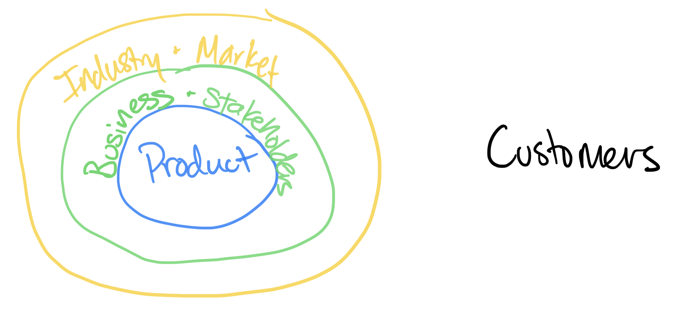

# Alignment

In his legendary book “INSPIRED: How to Create Tech Products Customers Love”, Marty Cagan presents a paradigm on the role of a Product Manager that can be broken down into 4 steps:

1. Become an expert on the customer, gathering both qualitative and quantitative data
2. Nurture a collaborative relationship with the product team
3. Convince them that you:
    1. Understand their constraints
    2. Will only bring them the best, as it falls under those constraints
4. Demonstrate you are an undisputed expert on the product and the industry

Let’s get a visual look at one way we can represent those steps.

## Break it down

We’ll align those 4 steps above with the diagram here. 

First, we have our **customers**. A product manager’s first job is to become an expert on the customer. Without that, you are not really managing a product, you are just managing *stuff* that likely no one really wants. [I’m too lazy to write a proper joke about your product tree falling in the forest and no one caring to check if it made a sound, sorry y’all]

Second, the **product team** takes aim. Try as you may, you cannot do ANYTHING without them. And, if you build the right relationships here the right way, they won’t want to do anything without you. 

The third point is where we start to branch out to a larger space, the surrounding **business and stakeholders**. Products live inside large business units that provide constraints such as budget, people, time, and more. The product team has its own capability concerns as well, and they are people- they want to be successful. The product manager has the powerful opportunity to balance all this information, and understand how to make everyone win. The business is able to meet its goals, the product team is able to achieve what is collaboratively planned, and the customers’ needs are increasingly met and feel the added value.

The fourth point is about understanding an even larger context. A customer, product, and business do not live in a vacuum, but among an **industry** full of direct and indirect competitors, and substitutes. Industries also represent opportunity; the mere existence of competition means there is something worth pursuing. 

## Aligning Forces

Reviewing Cagan’s ideas and drawing out these circles got me thinking more about the forces flowing through these circles. I started to focus on the relationship between the product and business circles. Certainly, these circles must expand and contract, but what pushes them to do so? 

Starting with our little product, I see forces pushing outward on the business. Our product is trying to grow in users, impact, revenue, etc. This circle likely will never have the goal to to shrink this product or circle, but rather improve the depth and breadth of the value it provides.

I see the business circle working the same way. The business is trying to push outward on the industry, similarly growing in users, impact, revenue, and more. Likely, its most desperate work is in the same direction as the product circle! 

This business and stakeholders, however, operates under constraints. Whether it is a matter of limited resources, or even strategic shutdowns as necessary, there are going to be some contracting forces from the outer business circle toward the product circle. The saying, “Do more with less” sounds cliché for a reason.

Peeking to the larger scope, something else interesting happens. Surely, there is some contraction that could be represented from the industry and market circle to the business circle from competition, but there is also expansion! The industry and market wants to grow! They too want more users, more impact, and more revenue from the customers that exist. 

Tracking these ideas, lets add some arrows to that diagram from before.

This is where I had an “Ah-ha!” moment. **There are so many outward arrows!** As it turns out, there some alignment across all of the circles! We all want to grow and expand, and if we can achieve those goals of more users, impact, and revenue, the resources expand and should enable further expansion. To take advantage of this, our job is to *address the contraction*. Let’s explore that really quick.

From a most basic level, the arrows from the industry inward on the business are about competition. Overcoming this is about high level business strategy against competition. Are we going to do it better? Cheaper? Faster? How is our business positioned? How do we aim to carve out our unique place in customers’ eyes? In this context, these aren’t questions product managers are typically positioned to answer, but they had better know what the firm’s leaders would answer to those questions. Which leads us to our next area of contraction.

How can a product manager deal with the contraction from a business on the product? “Patience” is probably a cheap answer, but its not too far off. I think “alignment” is likely more appropriate word. **This key spot, between the product team and the business, is where real value is created.** If a product manager can effectively balance constraints, and use their expertise of the customers, industry, and product, magic can happen. Value can be added in a way and at a rate where everyone wins. 

Let’s check back on the diagram. If this point of contraction, this set of arrows between the business and product, can be successfully managed, then there is alignment across the spectrum. Everyone is pointed the same direction, and that is toward growth.

So, back to Cagan’s 4 steps, a product manager’s job is to achieve this alignment. Become your product team’s best friend. Appreciate the constraints of the business. Challenge those constraints when appropriate, but be collaborative and don’t cry wolf too often. Now go make it happen!
