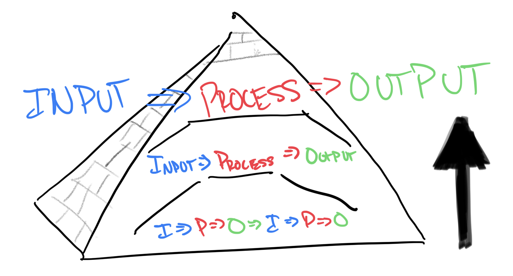

# Automation with IPO

Recently in a work situation, we were discussing with a client about how we might automate some of their current operations. We discussed various options, and I spent time evaluating approaches and how we might apply them in an efficient and effective manner, and it got me thinking about automation from a higher level. To explain where I was going, lets start with the IPO framework.

## IPO Framework

The core tenant of the [IPO Framework](https://en.wikipedia.org/wiki/Input–process–output_model_of_teams) is basically that work can be broken down into the following: **we take our INPUTS, we do some PROCESS, and get our OUTPUTS**. (This might seem like a really simple concept to have a fancy name for, but without naming these concepts, communication actually gets a LOT messier.)

Work can be seen as INPUT => PROCESS => OUTPUT, but that PROCESS step can be broken down into more detailed INPUT => PROCESS => OUTPUT steps chained together, and those down even deeper. Think about the work you do to sort through your emails. You take you new emails as input, apply some process (reading, scanning, filtering rules), and your output is an empty inbox. But each of those processes has its own IPO view. Reading takes the specific email's text as an input, follows the process of reading, and the output is knowledge and understanding of the email's meaning. Each sentence or word you are reading is another similar IPO step-wise process that you likely don't realize you are doing.

As is the case with many professions, IPO thinking is core to software engineering. It's all about taking some input (like a button click, or an online shopping cart, or a typed up message on Facebook), conducting some process (adding their email to a subscription list, a credit card charge, or saving the message text in a database), and delivering an output (a confirmation email, an order delivery notification, or alerting the other user of the message's arrival and some "message sent" feedback). Software engineering is all about figuring out what inputs you have, what output you want, and figuring out what process is necessary between the two. And when you get stuck on a particular part of that journey, you break it down even further to understand what this specific line of code has as an input, and what is going on that would give it the unexpected output. The IPO framework becomes really powerful when you work in this manner, going down the pyramid to understand sub-steps.

This IPO framework is a fairly natural way of thinking through solving problems, and one that software engineering interviewers try to see happen out-loud or on whiteboards in real time to evaluate individuals.

## Back to Automation

Automation is the process of trying to simplify or remove human steps from that middle section, the PROCESS. That can be everything from work by DevOps engineers to email sorting rules.

As you can imagine, this aligns well with our previous understanding IPO. If I need to take my new application code and deploy it to my server, that might sound like a big process to automate. But what if I could figure out how to automate compilation? Or automate the testing of the code? Or moving it from my local machine to the server? If I can chain together these operations, congrats! You've just automated your code deployment!

Often, automation happens this way. We take a process that we wish a human didn't have to do, and automate individual steps along the way until the whole thing (or as much as we can afford to do at the time) is handed off to some robots. Sometimes, if we are lucky, there are some off-the-shelf products we can either use entirely or string together to make this happen. That's great! But can we do better?

## Unlocking the Magic

Doing this downward-focused exercise is a great way to make automation happen. But the real power in automation comes from **looking up, not down**. What if instead of seeing how the process could be broken down into smaller steps, we instead try to how the work we are trying to do fits in a larger context of work? Solving problems in a more holistic ways like this often leads to more effective work overall.

When grocery shopping, downward-focused thinking takes us through each aisle, each item needed, and the quantity of each. Upward-focused thinking makes us review the experience overall. Maybe instead of going to the grocery story, I order online and go pick up the prepared bags. Maybe I skip the trip and just have them deliver the groceries I ordered to my door. Maybe I have a bunch of IoT buttons (think Amazon Dash Buttons) that I just press when I see I'm going low on stock of my favorite items. Maybe I setup some automatic scanning and reordering when my shelves notice I'm low on a particular item. Maybe I just have the local farm deliver to my door whenever the harvest comes in, before my shelves and I even notice we are low on stock.

Surely the foundational blocks from downward thinking remain. Whether its me, a store employee, a robot the store uses (Amazon's warehouse robots are WILD), someone has to go down the aisle with a shopping list of sorts. Somehow that item has to get to my kitchen shelves, and somehow the output of me eating that food will happen (drone delivery frmo the farm directly to my mouth???). Automating each step in the downstream is powerful. **Looking upward toward holistic automation is magical.**

## Why We Automate

As a side note, automation should just be about removing the human element from a small task, or saving someone time. Surely those can be valuable results (check out the early stats on human drivers vs self-driving cars, its remarkable), but that shouldn't be the final aim. It's about **improving the experience of those receiving the output**, and sometimes those providing the input. Sometimes full automation doesn't really improve the experience of those receiving the output. Think of a place where the human element is important. If Chic-fil-a made robots take and hand out the orders, would their customers feel as noticed, cared for, and served? It might be cheaper, but those personal experiences with trained employees and expectant customers improve the experience of the output and contribute to brand loyalty and returning customers. Don't forget the why when looking to automate.
